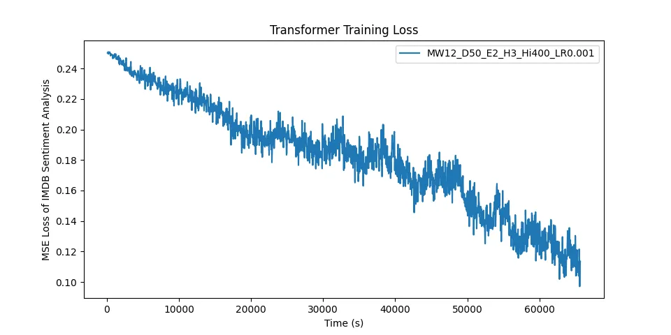

# Rust Transformer from Scratch

This repository contains a Rust implementation of a transformer built from scratch. The transformer is configured for sentiment analysis, and a [dataset of movie reviews](https://ai.stanford.edu/~amaas/data/sentiment/) is included in the repository for training and testing the transformer.

## Overview

This project implements an encoder-only transformer, built without any external machine learning libraries. The transformer uses word embeddings generated from my [WordEmbeddings repository](https://github.com/goldstraw/WordEmbeddings) to encode words. Sample word embeddings are included in the repository.

## Usage

To use this transformer implementation, you must have Rust and Cargo installed on your machine. After installing Rust and Cargo, you can clone this repository to your local machine and build the project with the following command:

To run the transformer, use the following command:

```
$ cargo run --release
```

This command will train the transformer on the movie review dataset and then run tests on a test set. The results of the training and testing will be printed to the console.

### Example Training

This specific model was trained with 12 words & 50 dimensions per sample, 2 encoder blocks, 3 attention heads, a hidden layer size of 400 and a learning rate of 0.001.

## Further Reading

Original paper: [Convolutional Neural Networks for Sentence Classification](https://arxiv.org/abs/1408.5882)

Original paper for dataset: [Learning Word Vectors for Sentiment Analysis](http://www.aclweb.org/anthology/P11-1015)

For more information about this project, read [my blog post on transformers](https://charliegoldstraw.com/articles/transformers/).

## License

The source code for the transformer is licensed under the GNU Affero General Public License v3.0 - see the `LICENSE` file for details.
